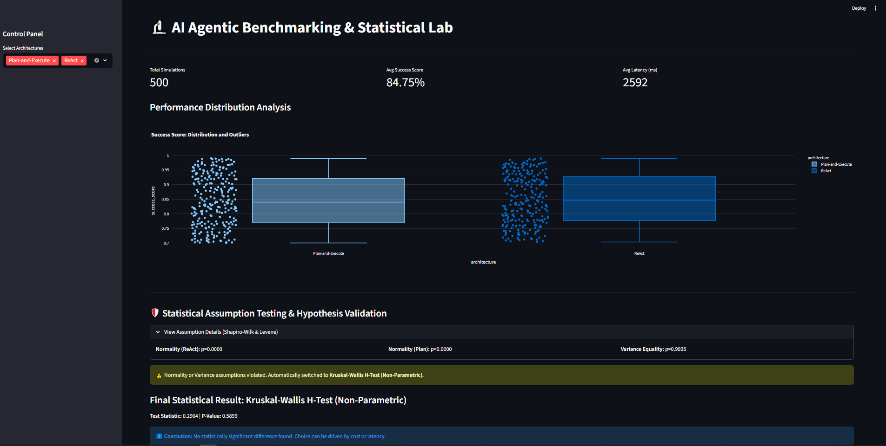
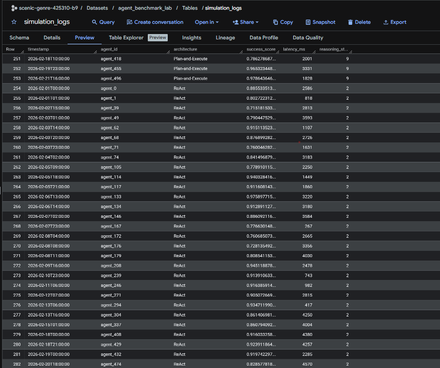

# 🔬 AI Agentic Benchmarking & Statistical Lab

This project is a high-stakes R&D framework designed to benchmark, monitor, and statistically validate the reasoning performance of LLM Agent architectures (ReAct vs. Plan-and-Execute). It ensures that architectural decisions are driven by scientific evidence rather than noise.

---

## 📊 Scientific Dashboard & Insights

The system provides an interactive monitoring layer for success scores, latency, and distribution outliers.


*Figure 1: Statistical Lab showing an average success score of 84.75% across 500 simulations.*

### 🛡️ Statistical Rigor (The Scientist's Signature)
Unlike simple average-based comparisons, this pipeline implements an **Adaptive Statistical Evaluation Layer**:

* **Assumption Testing:** Automated verification of Normality (Shapiro-Wilk) and Variance Equality (Levene’s Test).
* **Adaptive Inference:** The framework detected a normality violation ($p=0.0000$) and automatically performed a **Kruskal-Wallis H-Test** ($p=0.5899$) to ensure scientific validity.
* **Data-Driven Decision:** No statistically significant difference was found, enabling optimization focused on cost and latency.

---

## ☁️ Cloud Data Architecture (Google BigQuery)

All simulation logs are stored in a centralized cloud data warehouse using **Google BigQuery** for full traceability and scalability.


*Figure 2: Production logs in BigQuery tracking ReAct and Plan-and-Execute architectures.*

* **Automated Ingestion:** A dedicated pipeline uploads 500 rows of detailed simulation data (timestamp, agent_id, success_score, reasoning_steps) to the cloud.
* **Architecture Comparison:** The system simultaneously tracks multiple AI strategies to identify the most efficient reasoning path.

---

## 🛠️ Tech Stack

* **Infrastructure:** Google BigQuery (Cloud Data Warehouse)
* **Analytics:** Python (Pandas, Numpy, SciPy)
* **Visualization:** Streamlit & Plotly Express
* **Security:** Service Account-based authentication via `credentials.json`.

---

## 📂 Project Structure

* `src/ingestion.py`: The data pipeline responsible for generating and uploading 500 simulation rows to BigQuery.
* `src/analyzer.py`: The statistical engine that performs automated hypothesis testing.
* `app.py`: The primary Streamlit dashboard for real-time R&D monitoring.
* `credentials.json`: Secure Google Cloud authentication key (Git-ignored).

---

### 🚀 Getting Started

1. **Install dependencies:**
   ```powershell
   pip install google-cloud-bigquery pandas-gbq pyarrow streamlit scipy plotly