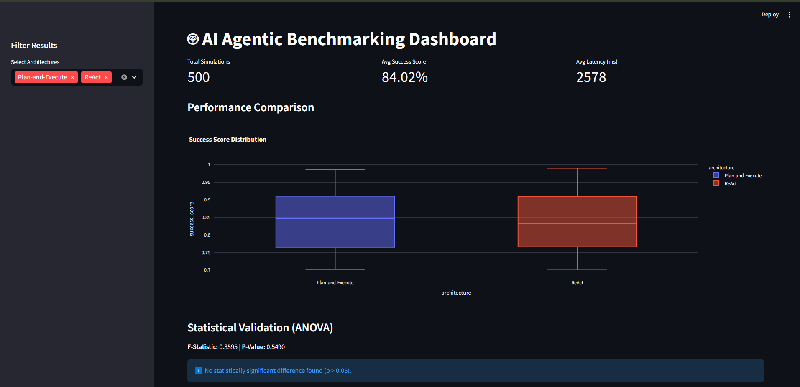
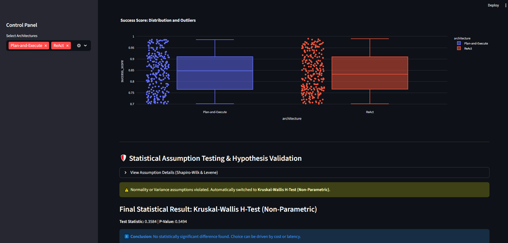

# 🔬 AI Agentic Benchmarking & Statistical Lab

An end-to-end evaluation framework designed to benchmark, monitor, and statistically validate the reasoning performance of LLM Agent architectures (ReAct vs. Plan-and-Execute).

## 🚀 Strategic Overview
This project simulates a high-stakes AI R&D environment. It automates agent performance logging into **Google BigQuery** and provides an adaptive statistical decision-making layer through an interactive **Streamlit** dashboard.

## 📊 Scientific Dashboard

*Interactive monitoring of success scores, latency, and distribution outliers.*

## 🛡️ Statistical Rigor (The Scientist's Signature)
Unlike simple average-based comparisons, this pipeline implements an **Adaptive Statistical Evaluation Layer**:

1. **Assumption Testing:** Automated verification of Normality (**Shapiro-Wilk**) and Variance Equality (**Levene’s Test**).
2. **Adaptive Inference:**
   - **Parametric:** Runs **One-Way ANOVA** if assumptions are met.
   - **Non-Parametric:** Automatically switches to **Kruskal-Wallis H-Test** if normality is violated.
3. **P-Value Validation:** Scientific confirmation of whether performance differences are statistically significant ($p < 0.05$) to avoid decision-making based on noise.

## 🛠 Tech Stack
- **Infrastructure:** Google BigQuery (Cloud Data Warehouse)
- **Analytics:** Python (Pandas, Numpy, SciPy)
- **Visualization:** Streamlit & Plotly Express (Interactive charts with outlier mapping)
- **Version Control:** Git (Production-ready repository structure)

## 📈 Current Insights
In recent simulations, the framework detected a normality violation ($p=0.0000$) and automatically performed a Kruskal-Wallis test, revealing that the performance difference between architectures was **not statistically significant** ($p=0.5494$), enabling data-driven optimization focused on cost and latency.