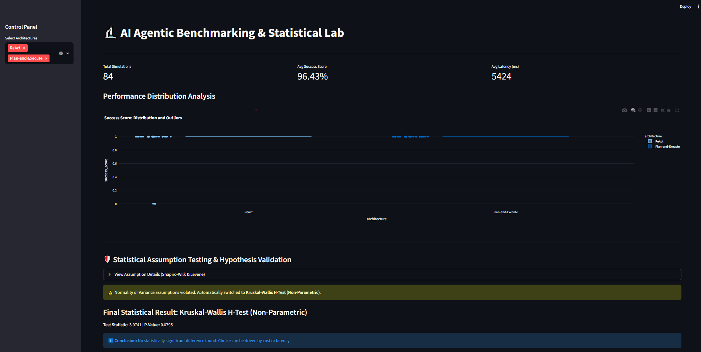

# 🔬 AI Agentic Benchmarking & Statistical Lab

This project is a high-stakes R&D framework designed to benchmark, monitor, and statistically validate the reasoning performance of LLM Agent architectures (ReAct vs. Plan-and-Execute). It ensures that architectural decisions are driven by scientific evidence rather than noise.

**This is a real-agent benchmark, not a synthetic simulation.** Every row is produced by actually invoking the ReAct and Plan-and-Execute agents (via the Groq-hosted `llama-3.3-70b-versatile` model) against a fixed set of finance questions, then logging the genuine tool calls, latency, and success outcome of each run.

---

## 📊 Scientific Dashboard & Insights

The system provides an interactive monitoring layer for success scores, latency, and distribution outliers.


*Figure 1: Statistical Lab showing an average success score of 96.43% across 84 real agent runs.*

### 🛡️ Statistical Rigor (The Scientist's Signature)
Unlike simple average-based comparisons, this pipeline implements an **Adaptive Statistical Evaluation Layer**:

* **Assumption Testing:** Automated verification of Normality (Shapiro-Wilk) and Variance Equality (Levene’s Test).
* **Adaptive Inference:** The framework detected a normality violation in the ReAct group ($p=0.0000$) and automatically performed a **Kruskal-Wallis H-Test** ($H=3.0741$, $p=0.0795$) to ensure scientific validity.
* **Data-Driven Decision:** No statistically significant difference was found between architectures, so the choice between them is driven by cost and latency rather than success rate.

#### Real Benchmark Results

| Metric | Value |
| --- | --- |
| Total runs | 84 (14 questions × 3 reps × 2 architectures) |
| Average success score | 96.43% |
| Normality test (ReAct) | Shapiro-Wilk p = 0.0000 → violated |
| Variance equality (Levene) | p = 0.0795 |
| Statistical test used | Kruskal-Wallis H-Test (non-parametric, auto-selected) |
| Result | H = 3.0741, p = 0.0795 → no statistically significant difference |

---

## ☁️ Cloud Data Architecture (Google BigQuery)

All simulation logs are stored in a centralized cloud data warehouse using **Google BigQuery** for full traceability and scalability.


*Figure 2: Production logs in BigQuery tracking ReAct and Plan-and-Execute architectures.*

* **Automated Ingestion:** A dedicated pipeline runs both agents against 14 finance questions × 3 reps and uploads 84 rows of real run data (timestamp, agent_id, success_score, latency_ms, reasoning_steps) to the cloud.
* **Architecture Comparison:** The system simultaneously tracks multiple AI strategies to identify the most efficient reasoning path.

---

## 🛠️ Tech Stack

* **Infrastructure:** Google BigQuery (Cloud Data Warehouse)
* **Analytics:** Python (Pandas, Numpy, SciPy)
* **Visualization:** Streamlit & Plotly Express
* **Security:** Service Account-based authentication via `credentials.json`.

---

## 📂 Project Structure

* `src/ingestion.py`: The data pipeline that runs real ReAct/Plan-and-Execute agent calls against the test question set and uploads the resulting 84 rows to BigQuery.
* `src/analyzer.py`: The statistical engine that performs automated hypothesis testing.
* `app.py`: The primary Streamlit dashboard for real-time R&D monitoring.
* `credentials.json`: Secure Google Cloud authentication key (Git-ignored).

---

### 🚀 Getting Started

1. **Install dependencies:**
   ```powershell
   pip install google-cloud-bigquery pandas-gbq pyarrow streamlit scipy plotly